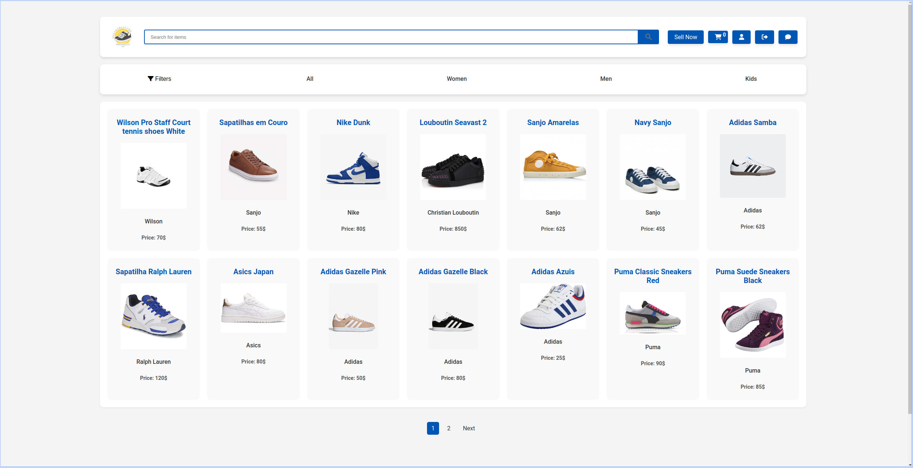
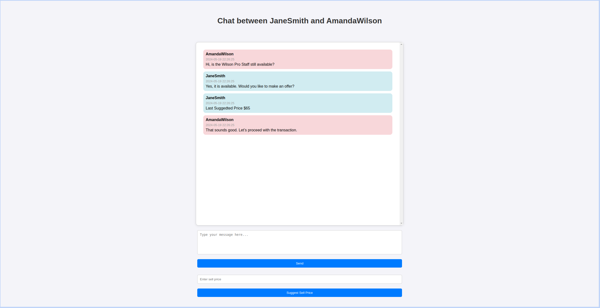
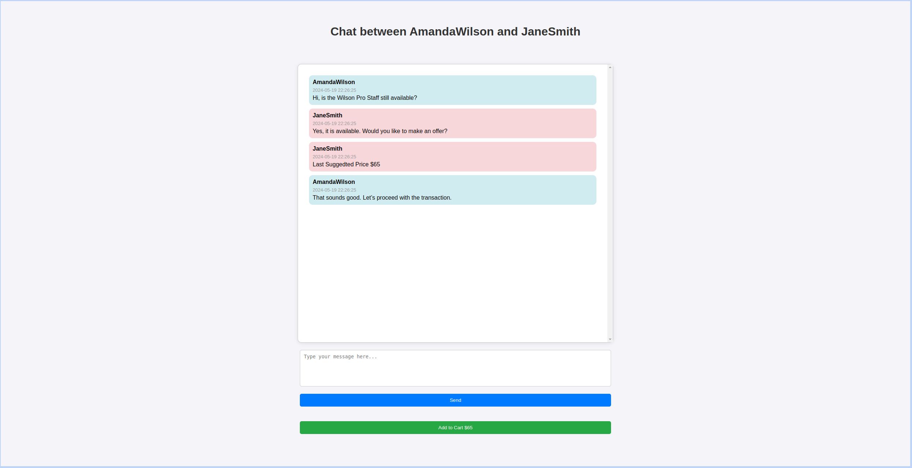
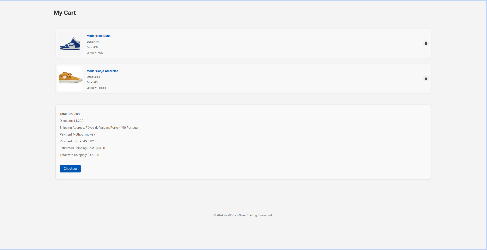

# SneakerCycle

- SneakerCycle is a dynamic online platform dedicated to the buying and selling of pre-loved sneakers. Our website offers users a platform allowing them to easily list their sneakers for sale, browse through a diverse range of options, communicate and transact with other users. 

## Group ltw12g01

- Carlos Filipe Oliveira Sanches Pinto (up202107694) 34%

- João Maria Correia Rebelo (up202107209) 33%

- Tiago Campos Lourenço (up202004374) 33%

## Install Instructions

    git clone git@github.com:FEUP-LTW-2024/ltw-project-2024-ltw12g01.git

    git checkout final-delivery-v1

    sqlite3 database/database.db < database/database.sql

    php -S localhost:9000

## Screenshots

## Important Topics
    For being easier to interact with all the features, we are showcasing some topics:
#### Our user privelege system has 3 classes, buyer,  buyer/seller and admin.
    -All users start being buyers only, when they list a product they, gain the status buyer/seller being able to see and manage their posted products.
    -Admins, can edit/delete posted products and edit/delete users information and status.
    -All accounts have the same password ('@Password123').
    -Admin accounts: rebelo@example.com, carlos@example.com, tiago@example.com

## Implemented Features

**General**:

- [X] Register a new account.

- [X] Log in and out.

- [X] Edit their profile, including their name, username, password, and email.

- [X] Pagination for a smoother experience.

- [X] Dynamic Searching.

- [X] Dynamic and static Filters.

**Sellers**  should be able to:

- [X] List new items, providing details such as category, brand, model, size, and condition, along with images.

- [X] Track and manage their listed items.

- [X] Respond to inquiries from buyers regarding their items and add further information if needed.

- [X] Print shipping forms for items that have been sold.

**Buyers**  should be able to:

- [X] Browse items using filters like category, price, and condition.

- [X] Engage with sellers to ask questions or negotiate prices.

- [X] Add items to a wishlist or shopping cart.

- [X] Proceed to checkout with their shopping cart (simulate payment process).

**Admins**  should be able to:

- [X] Elevate a user to admin status.

- [X] Introduce new item categories, sizes, conditions, and other pertinent entities.

- [X] Oversee and ensure the smooth operation of the entire system.

**Security**:

We have been careful with the following security aspects:

- [X] **SQL injection**

- [X] **Cross-Site Scripting (XSS)**

- [X] **Cross-Site Request Forgery (CSRF)**

**Password Storage Mechanism**: hash_password&verify_password

**Aditional Requirements**:

We also implemented the following additional requirements:

- [X] **Promotional Features**

- [X] **API Integration**

- [X] **Dynamic Promotions**

- [X] **Shipping Costs**

- [X] **Real-Time Messaging System**

- [X] **Sellers can suggest prices in real-time inside the chat to the other user**

- [X] **Inside the chat Buyers can add to cart the product with the suggested seller price**
